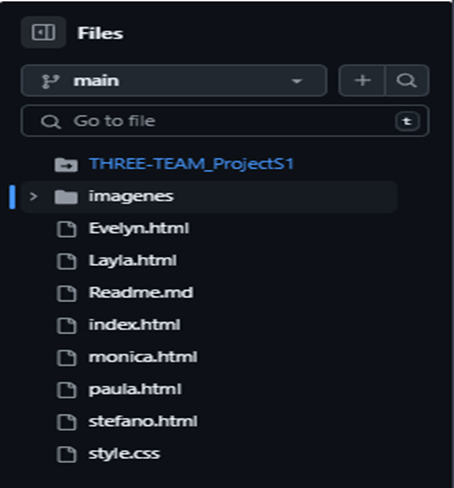

# 🎵 Proyecto Web S3 #

## 📝 Descripción ##
Este proyecto es una página web estática alojada en Amazon S3 que muestralos gustos musicales de nuestro equipo de colaboradores. La web permite conocer mejor a nuestro equipo a tráves de la música. Creando así un espacio más personal y cercano.

## 🚀 Características ##
	- Perfiles de colaboradores con sus géneros musicales favoritos.
    - Interfaz responsiva y amigable.

## 🛠️ Tecnologías utilizadas ## 
	- HTML5
	- CSS
    - Amazon S3 para hosting
    - AWS Amplify para el despliegue

## 📂 Estructura del proyecto ##

## 🔧 Instalación del repositorio ##
 git clone https://github.com/Segunda-Formula/cosasEnComun.git

## 🙏 Agradecimientos ## 
- Al equipo por compartir sus gustos musicales
- Al equipo formativo de AWS Cloud

